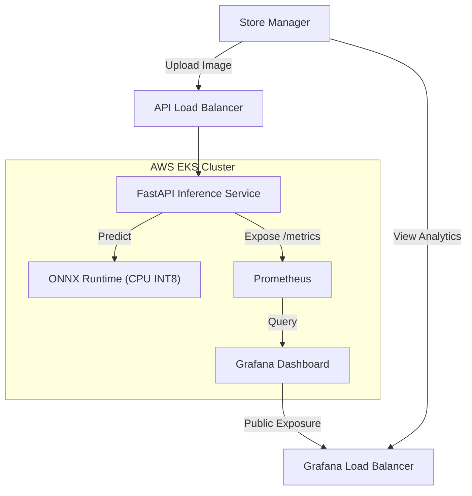

# 🏪 ShelfWatch

<div align="center">


**Retail inventory analysis pipeline.**
*Automated product detection and stock monitoring at scale.*

[**Interactive Demo**](http://a86b4f4c852b64526ae8c22a8b715100-2106448101.us-east-1.elb.amazonaws.com) • [**Metrics Dashboard**](http://aa7f24b6fcb1840baa60271925a86de9-1362079785.us-east-1.elb.amazonaws.com) • [**Technical Documentation**](docs/architecture.md)

</div>

---

## 🚀 Overview

**ShelfWatch** is an MLOps system for automated supermarket stock auditing. It implements a fine-tuned **YOLOv8** object detection model deployed as a scalable inference service on AWS EKS.


### Core Capabilities
*   **Automated Infrastructure**: Deployment and lifecycle management via `eksctl` and `kubectl`.
*   **Latency-Optimized Inference**: INT8 quantization provides sub-500ms response times on CPU.
*   **Integrated Monitoring**: Performance telemetry aggregated via Prometheus and Grafana.
*   **Dynamic Scaling**: Resource allocation managed by Kubernetes Horizontal Pod Autoscaler.

## 🏗️ Architecture

The system utilizes a microservices architecture on **AWS EKS**. Traffic is distributed via AWS Load Balancers (ELB) to isolated inference and observability pods.



## ✨ Key Technical Features

- **⚡ Optimized Runtime**: YOLOv8 conversion to **ONNX INT8** reduces model footprint and latency.
- **📈 Comprehensive Observability**: Custom dashboard monitoring p99 latency, resource utilization, and model output.
- **🎨 Interactive Frontend**: Canvas-based UI for near real-time visualization of detection results.
- **☁️ Infrastructure as Code**: PowerShell-based deployment (`deploy.ps1`) and teardown automation.
- **🛡️ Distributed Scaling**: Fault-tolerant deployment with integrated health checks and autoscaling.

## 📊 Performance Monitoring

System health and inference quality are monitored through a centralized dashboard:


## 🛠️ Tech Stack

| Component | Technology |
|---|---|
| **Model** | YOLOv8 (Ultralytics) |
| **Optimization** | ONNX Runtime (INT8 Dynamic Quantization) |
| **API Layer** | FastAPI (Python) |
| **Frontend** | JavaScript / HTML5 / Canvas |
| **Infrastructure** | AWS EKS, ELB, ECR |
| **Monitoring** | Prometheus, Grafana |

## ⚡ Deployment & Local Usage

### 1. Local Containerized Environment

Initialize the local development stack via Docker Compose:

```bash
docker compose up --build
```
The **API** is accessible at `http://localhost:8000` and **Grafana** at `http://localhost:3000`.

### 2. AWS Cluster Deployment

Automatic provisioning to AWS EKS:

```powershell
.\infra\aws\deploy.ps1
```

### 3. Remote Verification

```powershell
$env:API_URL="http://<YOUR-LB-URL>"
python scripts/demo_predict.py scripts/shelf.jpg
```

## 📂 Repository Structure

```
ShelfWatch/
├── docs/               # System architecture and specifications
├── images/             # Documentation and interface assets
├── inference/          # Application logic and model orchestration
├── infra/              # Kubernetes manifests and AWS IaC
├── scripts/            # Model export and quantization utilities
├── tests/              # API and logic verification suite
└── ui/                 # Static frontend assets
```

## 📜 License

MIT License.

