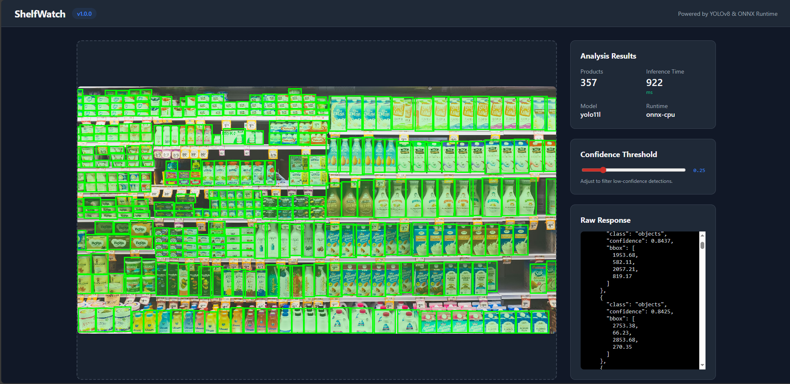
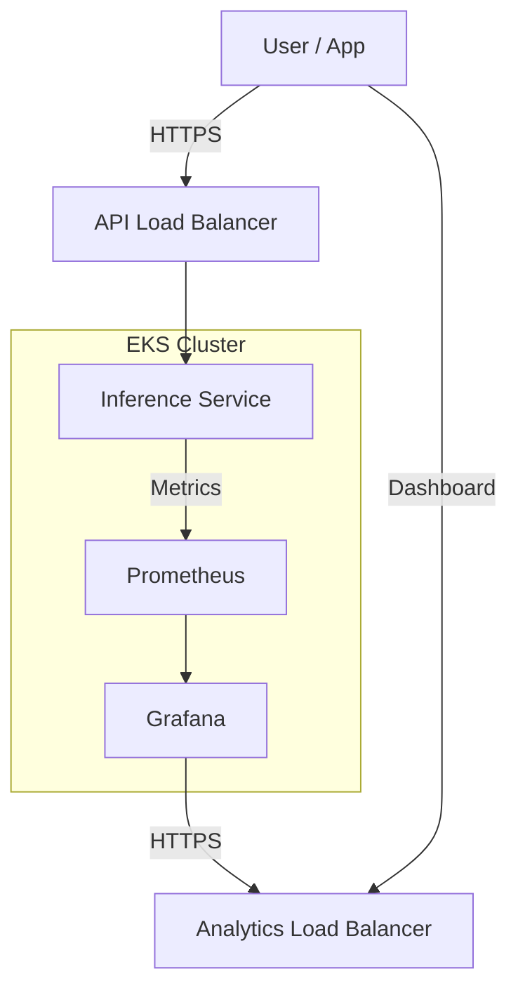
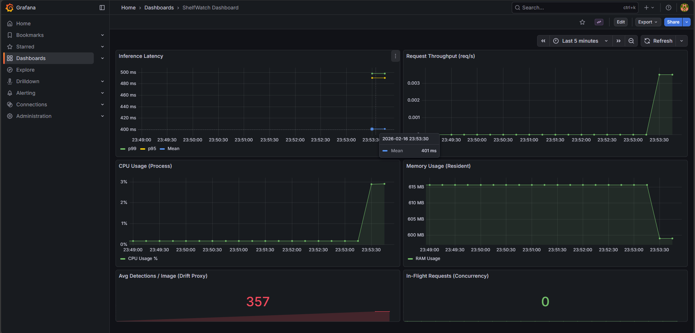

# 🏪 ShelfWatch

<div align="center">


**Retail inventory analysis system.**
*Object detection and stock monitoring at scale.*

[**Demo UI**](http://a86b4f4c852b64526ae8c22a8b715100-2106448101.us-east-1.elb.amazonaws.com) • [**Analytics Dashboard**](http://aa7f24b6fcb1840baa60271925a86de9-1362079785.us-east-1.elb.amazonaws.com) • [**Architecture Docs**](docs/architecture.md)

</div>

---

## 🚀 Overview

**ShelfWatch** is an automated stock auditing platform that utilizes a fine-tuned **YOLOv8** model for product detection. The system is deployed as a scalable inference service on AWS EKS, optimized for low-latency CPU execution.



### Key Technical Characteristics
*   **Automated Infrastructure**: Deployment and lifecycle management via `eksctl` and `kubectl`.
*   **Latency-Optimized Inference**: INT8 quantization provides sub-500ms response times on CPU.
*   **Integrated Monitoring**: Performance telemetry aggregated via Prometheus and Grafana.
*   **Continuous Integration**: Automated linting and testing via GitHub Actions.
*   **Dynamic Scaling**: Resource allocation managed by Kubernetes Horizontal Pod Autoscaler. (HPA) integration based on resource utilization.

## 🏗️ System Architecture

The architecture follows a microserviced approach within an **AWS EKS** cluster. External traffic is routed through AWS Load Balancers to isolated inference and observability endpoints.



### Components
- **Inference Service**: FastAPI application serving detection requests.
- **Model Engine**: In-process ONNX Runtime (CPU) executing quantized weights.
- **Monitoring Stack**: Prometheus for metric collection and Grafana for visualization.

## 📡 API Reference

The primary interface for system interaction is the REST API.

### 1. Object Detection
`POST /predict`
- **Description**: Analyzes a shelf image and returns detected product instances.
- **Input**: `multipart/form-data` containing an image file.
- **Response**: JSON with bounding boxes, class labels, and confidence scores.

### 2. Monitoring & Health
| Endpoint | Method | Purpose |
| :--- | :--- | :--- |
| `/health` | GET | Readiness and liveness probe status. |
| `/metrics` | GET | Prometheus-formatted application metrics. |

## 📊 Performance Monitoring

Real-time telemetry includes tail latency tracking (p95/p99) and resource consumption:



## 🛠️ Tech Stack

- **Model**: YOLOv8 (Ultralytics)
- **Runtime**: ONNX Runtime (INT8 Quantized)
- **Backend**: FastAPI (Python)
- **Frontend**: Vanilla JavaScript / HTML5 / Canvas
- **Cloud**: AWS EKS, ELB, ECR
- **Observability**: Prometheus, Grafana

## ⚡ Setup & Deployment

### Local Environment (Docker)
Run the complete stack using Docker Compose:
```bash
docker compose up --build
```
The **Interactive UI** is served at `http://localhost:8000`.

### AWS Deployment & CI/CD

The project is configured for **Continuous Deployment (CD)** via GitHub Actions. Any push to `main` automatically triggers:
1.  **Quality Check**: Automated linting (`ruff`) and testing (`pytest`).
2.  **Container Build**: Optimized Docker image creation (`Dockerfile.aws`).
3.  **ECR Push**: Automatic upload to the Amazon ECR registry.
4.  **EKS Rollout**: Seamless rolling update to the Kubernetes cluster.

### 📉 Cost Optimization & Deployment Strategy

To maintain a production-grade infrastructure on a budget, this project implements several cloud-native cost-saving measures:

-   **AWS Spot Instances**: The cluster utilizes [Spot instances](https://aws.amazon.com/ec2/spot/) for its managed nodegroups, providing **70-90% savings** compared to on-demand pricing.
-   **Instance Diversification**: The node group is diversified across `m7i-flex.large`, `c7i-flex.large`, and `t3.small` types to ensure high Spot fulfillment and resilience.
-   **Resource "Bin-Packing"**: CPU requests are right-sized to `200m` based on real-world telemetry (~6% CPU usage), allowing for dense pod packing on smaller nodes.
-   **Blue/Green Node Migration**: The infrastructure is designed for "hot" migration. New node groups can be provisioned and old ones drained without any impact on the production LoadBalancer URLs.

To provision the infrastructure for the first time or perform a manual deployment, use:

```powershell
.\infra\aws\deploy.ps1
```

## 📂 Project Structure

```
ShelfWatch/
├── docs/               # Technical specifications and diagrams
├── images/             # Documentation assets
├── inference/          # API layer and model runner
├── infra/              # Kubernetes and AWS manifests
├── scripts/            # Management and export utilities
├── tests/              # Functional and unit verification
└── ui/                 # Static frontend code
```

## 📜 License
MIT License.

