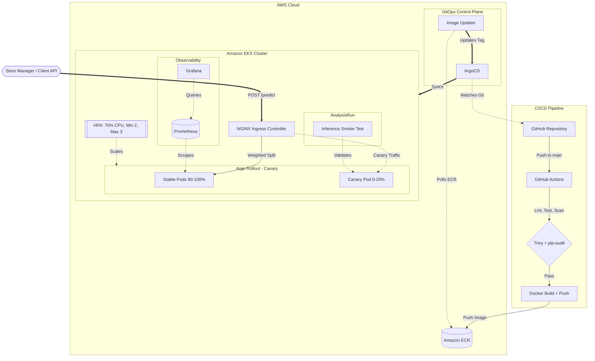
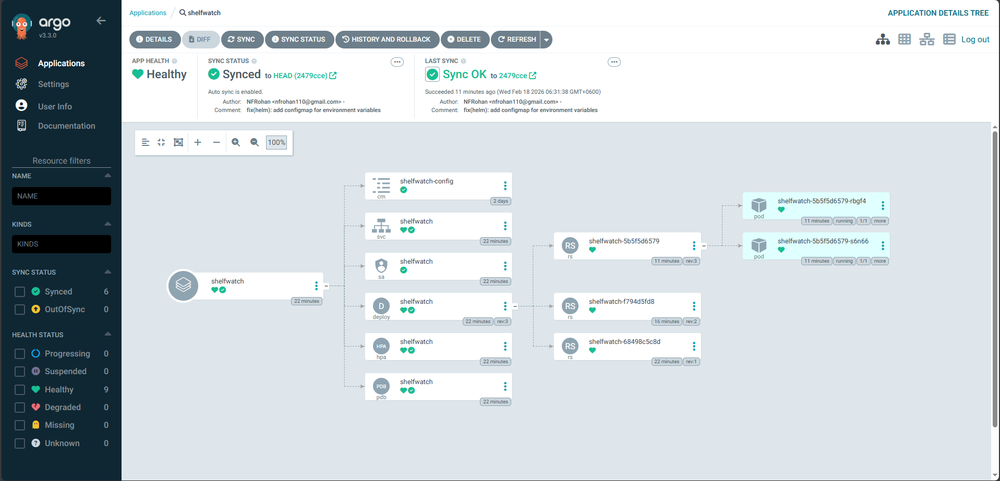

# 🏪 ShelfWatch

<div align="center">


**Retail inventory analysis system.**
*Object detection and stock monitoring at scale.*

[**Demo UI**](http://a3033d45162184da488eb645414d2ffb-1014427016.us-east-1.elb.amazonaws.com) • [**Architecture Docs**](docs/architecture.md)

</div>

---

## 🚀 Overview

**ShelfWatch** is an automated stock auditing platform that utilizes a fine-tuned **YOLO11L** model for product detection. The system is deployed as a scalable inference service on AWS EKS, optimized for low-latency CPU execution.


### Key Technical Characteristics
*   **Progressive Delivery**: Canary deployments via Argo Rollouts with automated smoke tests before promotion.
*   **Latency-Optimized Inference**: INT8 quantization provides sub-500ms response times on CPU.
*   **DevSecOps Pipeline**: Container scanning (Trivy) and dependency auditing (pip-audit) integrated into CI.
*   **GitOps-Driven**: ArgoCD + Image Updater for fully automated, drift-free deployments.
*   **Dynamic Scaling**: NGINX Ingress with weighted traffic splitting and HPA-driven autoscaling.
*   **Spot Resilience**: Built-in 2-minute interruption handling with Pod Disruption Budgets (PDB) and multi-node redundancy for zero-downtime operation on AWS Spot instances.

## 🏗️ System Architecture

The architecture follows a microserviced approach within an **AWS EKS** cluster. External traffic is routed through an **NGINX Ingress Controller** that supports weighted canary traffic splitting for progressive delivery.



### Components
- **Inference Service**: FastAPI application serving detection requests.
- **Model Engine**: In-process ONNX Runtime (CPU) executing quantized weights.
- **Monitoring Stack**: Prometheus for metric collection and Grafana for visualization.

## 📡 API Reference

The primary interface for system interaction is the REST API.

### 1. Object Detection
`POST /predict`
- **Description**: Analyzes a shelf image and returns detected product instances.
- **Input**: `multipart/form-data` containing an image file.
- **Response**: JSON with bounding boxes, class labels, and confidence scores.

### 2. Monitoring & Health
| Endpoint | Method | Purpose |
| :--- | :--- | :--- |
| `/health` | GET | Readiness and liveness probe status. |
| `/metrics` | GET | Prometheus-formatted application metrics. |

## 📊 Performance Monitoring

Real-time telemetry includes tail latency tracking (p95/p99) and resource consumption:


## 🛠️ Tech Stack

- **Model**: YOLO11L (Ultralytics)
- **Runtime**: ONNX Runtime (INT8 Quantized)
- **Backend**: FastAPI 0.115+ (Python)
- **Frontend**: Vanilla JavaScript / HTML5 / Canvas
- **Cloud**: AWS EKS, ECR
- **Networking**: NGINX Ingress Controller (L7 traffic routing)
- **DevOps**: Helm, ArgoCD, Argo Rollouts, ArgoCD Image Updater, GitHub Actions
- **Security**: Trivy (container scanning), pip-audit (dependency scanning)
- **Observability**: Prometheus, Loki, Promtail, Grafana

## ⚡ Setup & Deployment

### Local Environment (Docker)
Run the complete stack using Docker Compose:
```bash
docker compose up --build
```
The **Live Interactive UI** is served at [http://a3033d45162184da488eb645414d2ffb-1014427016.us-east-1.elb.amazonaws.com/](http://a3033d45162184da488eb645414d2ffb-1014427016.us-east-1.elb.amazonaws.com/).

### AWS Deployment & CI/CD

The project uses a **fully automated, secure CI/CD pipeline**. Any push to `main` triggers:
1.  **Quality Gate**: Linting (`ruff`), testing (`pytest`), and dependency audit (`pip-audit`).
2.  **Container Build**: Docker image with GHA layer caching.
3.  **Security Scan**: Trivy scans for High/Critical CVEs before push.
4.  **ECR Push**: Verified image uploaded to Amazon ECR.
5.  **Auto-Deploy**: ArgoCD Image Updater detects the new tag and triggers a **Canary Rollout** through Argo Rollouts.

### 📉 Cost Optimization & Deployment Strategy

To maintain a production-grade infrastructure on a budget, this project implements several cloud-native cost-saving measures:

-   **AWS Spot Instances**: The cluster utilizes [Spot instances](https://aws.amazon.com/ec2/spot/) for its managed nodegroups, providing **70-90% savings** compared to on-demand pricing.
-   **Instance Diversification**: The node group is diversified across `m7i-flex.large`, `c7i-flex.large`, and `t3.small` types to ensure high Spot fulfillment and resilience.
-   **Resource "Bin-Packing"**: CPU requests are right-sized to `200m` based on real-world telemetry (~6% CPU usage), allowing for dense pod packing on smaller nodes.
-   **Blue/Green Node Migration**: The infrastructure is designed for "hot" migration. New node groups can be provisioned and old ones drained without any impact on the production LoadBalancer URLs.

### ☁️ GitOps & Progressive Delivery

The project implements a mature **GitOps** model with **progressive delivery**:

1.  **Helm Packaging**: The entire application (Rollout, Service, Ingress, HPA, ConfigMap) is defined as a reusable [Helm Chart](./charts/shelfwatch).
2.  **ArgoCD + Image Updater**: An in-cluster ArgoCD controller monitors GitHub. The Image Updater polls ECR for new tags — **no CI-to-Git commits needed**.
3.  **NGINX Ingress**: Layer 7 traffic routing with weighted canary splitting (even with 1 node).
4.  **Canary Deployments**: Argo Rollouts progressively shifts traffic (20% → 50% → 100%) with an automated **inference smoke test** between steps. Failed tests trigger automatic rollback.



To provision the infrastructure for the first time or perform a manual deployment, use:

```powershell
.\infra\aws\deploy.ps1
```

## 📂 Project Structure

```
ShelfWatch/
├── charts/             # Helm chart (Rollout, Ingress, Services, HPA)
├── docs/               # Technical specifications and diagrams
├── images/             # Documentation assets
├── inference/          # API layer and model runner
├── infra/              # Kubernetes, AWS, and ArgoCD manifests
├── scripts/            # Management and export utilities
├── tests/              # Functional and unit verification
└── ui/                 # Static frontend code
```

## 📜 License
MIT License.
