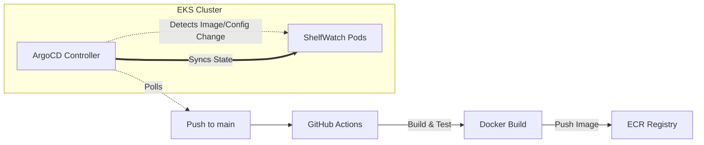

# 🏪 ShelfWatch — Automated Retail Shelf Analyzer

> **Backend-first, portfolio-grade MLOps project**
> A production-style object-detection pipeline for supermarket shelf analysis, built to showcase model lifecycle management, scalable inference, observability, and developer ergonomics.

---

## Tech Stack

| Layer | Technology |
|---|---|
| **Dataset & Labeling** | Roboflow |
| **Model Training** | Ultralytics YOLO11 |
| **Inference API** | FastAPI |
| **Containerization** | Docker (multi-stage) |
| **Orchestration** | Kubernetes / Minikube (local) / EKS (prod) |
| **Cloud Infra** | AWS — ECR, EKS, S3, CloudWatch |
| **Metrics** | Prometheus |
| **Dashboards** | Grafana |
| **Model Registry** | MLflow |
| **Optimized Inference** | ONNX Runtime / NVIDIA Triton (optional) |

---

## Project Goals

1. **Production-style model lifecycle** — dataset & model versioning, automated retrain pipeline, model registry.
2. **Scalable inference** — containerized FastAPI + autoscaling in k8s, GPU-aware when available.
3. **Low-latency, high-throughput inference** — optional ONNX / Triton path.
4. **Observability** — latency/error metrics, model-accuracy drift alerts, annotation / active-learning loop.
5. **Developer ergonomics & reproducibility** — infra-as-code, CI/CD, clear README + demo.
6. **Showcase features** — real-time dashboard, simulated load test, human-in-the-loop annotation UI.

---

## Monorepo Layout

```
ShelfWatch/
├── dataset/            # Dataset configs, YOLO11 YAML, sample pointers
├── training/           # Training scripts, MLflow logging, evaluation
├── inference/          # FastAPI app, Dockerfile, ONNX export
├── infra/
│   ├── k8s/            # Deployment, Service, HPA, Prometheus manifests
│   └── terraform/      # EKS / ECR / S3 IaC (Sprint 7)
├── ui/                 # Annotation UI + demo dashboard
├── ci/                 # GitHub Actions workflows
├── docs/               # Architecture diagrams, design decisions
├── SPRINT_PLAN.md      # ← You are here
└── README.md           # Project overview & quickstart
```

---

## Sprint Roadmap

### Sprint 0 — Project Setup & MVP Scoping *(~0.5 week)*

**Goal:** Align on MVP, repo layout, and basic CI.

| # | Task | Status |
|---|---|---|
| 0.1 | Create monorepo with folder structure above | ☐ |
| 0.2 | Write initial `README.md` with architecture diagram and demo-flow overview | ☐ |
| 0.3 | Add sample data pointer (Roboflow dataset link or `dataset/README.md`) | ☐ |
| 0.4 | Set up GitHub repo + branch protection rules | ☐ |
| 0.5 | Add simple CI — lint (`ruff`) + unit-test stub (`pytest`) | ☐ |

**Deliverable:** Repo scaffold + README explaining the intended demo flow.

---

### Sprint 1 — Dataset, Baseline Training & Evaluation *(1 week)*

**Goal:** Get a working YOLO11 model trained on a public shelf dataset and export `best.pt`.

| # | Task | Status |
|---|---|---|
| 1.1 | Download a supermarket-shelf dataset from Roboflow; convert to YOLO11 format | ☐ |
| 1.2 | Write `training/train.py` using Ultralytics to produce `best.pt` | ☐ |
| 1.3 | Evaluate on holdout set — log mAP, precision, recall | ☐ |
| 1.4 | Log metrics to simple CSV **and** to MLflow experiment | ☐ |

**Deliverable:** `best.pt`, evaluation report, MLflow experiment entry.

<details>
<summary>📝 Example training snippet</summary>

```python
# training/train.py
from ultralytics import YOLO

model = YOLO("yolo11n.pt")
model.train(data="dataset/shelf.yaml", epochs=30, imgsz=640, batch=8)
# Ultralytics auto-saves best.pt to runs/detect/train/weights/
```

</details>

---

### Sprint 2 — FastAPI Inference Service (MVP) + Local Docker *(1 week)*

**Goal:** Serve the model via a clean `POST /predict` endpoint and containerize it.

| # | Task | Status |
|---|---|---|
| 2.1 | Build FastAPI app — accept image upload (`multipart/form-data`), run inference, return JSON (boxes, scores, class names) | ☐ |
| 2.2 | Add input validation (file type, size limits) and concurrency-safe model loading (load once at startup) | ☐ |
| 2.3 | Create multi-stage `Dockerfile` (slim final image, `opencv-python-headless`) | ☐ |
| 2.4 | Write local run + demo script (`scripts/demo_predict.py`) | ☐ |

**Deliverable:** `Dockerfile`, FastAPI app, local demo calling `/predict`.

<details>
<summary>📝 Example FastAPI app</summary>

```python
# inference/app.py
from fastapi import FastAPI, File, UploadFile
from ultralytics import YOLO
import numpy as np
from PIL import Image
import io

app = FastAPI(title="ShelfWatch Inference API")
model = YOLO("weights/best.pt")  # loaded once at startup

@app.post("/predict")
async def predict(image: UploadFile = File(...)):
    img = Image.open(io.BytesIO(await image.read())).convert("RGB")
    results = model.predict(np.array(img), imgsz=640, conf=0.25)
    detections = []
    for r in results:
        for box in r.boxes:
            detections.append({
                "class": r.names[int(box.cls)],
                "confidence": float(box.conf),
                "bbox": box.xyxy[0].tolist(),
            })
    return {"detections": detections}
```

</details>

<details>
<summary>📝 Example Dockerfile</summary>

```dockerfile
FROM python:3.10-slim AS builder
WORKDIR /app
COPY requirements.txt .
RUN pip install --no-cache-dir -r requirements.txt

FROM python:3.10-slim
WORKDIR /app
COPY --from=builder /usr/local/lib/python3.10/site-packages \
                     /usr/local/lib/python3.10/site-packages
COPY . /app
EXPOSE 8000
CMD ["uvicorn", "app:app", "--host", "0.0.0.0", "--port", "8000", "--workers", "1"]
```

</details>

---

### Sprint 3 — Infra IaC + Kubernetes Manifests + Local K8s Testing *(1 week)*

**Goal:** Deploy the container locally with Kubernetes and test scaling via Minikube.

| # | Task | Status |
|---|---|---|
| 3.1 | Write `infra/k8s/deployment.yaml`, `service.yaml` (ClusterIP / LoadBalancer), `hpa.yaml` | ☐ |
| 3.2 | Add readiness & liveness probes (`/health` endpoint) | ☐ |
| 3.3 | Deploy to Minikube and validate with `kubectl` | ☐ |
| 3.4 | Run load tests (`hey` or `wrk`) — measure throughput & latency | ☐ |

**Deliverable:** Tested manifests in `infra/k8s/`, load-test report.

> [!NOTE]
> For ML inference, CPU utilization is often a poor HPA signal. Plan to integrate custom Prometheus metrics (request latency, in-flight requests) in Sprint 4.

---

### Sprint 4 — Observability, Logging & Autoscaling Tuning *(1 week)*

**Goal:** Add metrics, logs, dashboards, and alerts for model drift / performance regressions.

| # | Task | Status |
|---|---|---|
| 4.1 | Add Prometheus exporter to FastAPI (request latency, in-flight requests, inference time, memory) | ☐ |
| 4.2 | Deploy Prometheus + Grafana; build inference dashboard | ☐ |
| 4.3 | Integrate structured logging to CloudWatch (or ELK); add Sentry for error capture | ☐ |
| 4.4 | Configure HPA with custom Prometheus metrics (e.g., P95 latency) | ☐ |
| 4.5 | Set up alert rules (Slack / email) for rising error rate, mAP drop, class-frequency drift | ☐ |

**Deliverable:** Grafana dashboard screenshots, alert-rule configs, CI smoke-test job.

---

### Sprint 5 — Model Optimization & Alternate Inference Path *(1 week)*

**Goal:** Reduce latency & image size. Add ONNX / Triton path and CPU-friendly options.

| # | Task | Status |
|---|---|---|
| 5.1 | Export model to ONNX; benchmark with ONNX Runtime (CPU) | ☐ |
| 5.2 | *(Optional)* Build Triton config and benchmark GPU throughput | ☐ |
| 5.3 | Run INT8 quantization experiments for CPU / edge deployment | ☐ |
| 5.4 | Add inference-mode toggle to API (`?mode=fast` vs `?mode=accurate`) | ☐ |

**Deliverable:** Benchmark table (PyTorch vs ONNX vs Triton), recommendation in README.

---

### Sprint 6 — [SKIPPED] Active Learning + Annotation UI
*(User decision: minimal impact for current scope)*

---

### Sprint 7 — Productionize on AWS + Infra Hardening *(1 week)*

**Goal:** Push images to ECR, deploy to EKS, secure the stack.

| # | Task | Status |
|---|---|---|
| 7.1 | Push Docker image to ECR; provision EKS cluster via Terraform / eksctl | ☐ |
| 7.2 | Apply manifests to staging; use GPU node groups if required | ☐ |
| 7.3 | Add IAM roles, secrets management (AWS Secrets Manager / k8s Secrets), VPC / egress rules | ☐ |
| 7.4 | Configure Cluster Autoscaler; test failover scenarios | ☐ |

**Deliverable:** Production deployment doc + Terraform / eksctl scripts to reproduce. Optional external demo link.

---

### Sprint 8 — Polishing, Documentation, Demo & Portfolio Artifacts *(1 week)*

**Goal:** Make it demo-ready for interviews and portfolio.

| # | Task | Status |
|---|---|---|
| 8.1 | Build interactive demo page — image upload, result visualization, latency chart, model info (version, mAP) | ☐ |
| 8.2 | Write comprehensive README — architecture diagrams, design decisions, "How I'd scale to X req/s" | ☐ |
| 8.3 | Record 3–5 min screencast walkthrough | ☐ |
| 8.4 | Create one-page project summary for résumé | ☐ |

**Deliverable:** Portfolio-ready repo, README, demo link, screencast.

---

### Sprint 11 — DevOps Transformation (GitOps) ☁️ *(1 week)*

**Goal:** Migrate to a pull-based deployment model using Helm and ArgoCD.

| # | Task | Status |
|---|---|---|
| 11.1 | Package application as a Helm Chart (`charts/shelfwatch`) | ✅ |
| 11.2 | Install ArgoCD on EKS and expose UI | ✅ |
| 11.3 | Implement GitOps workflow (ArgoCD watches GitHub `main`) | ✅ |
| 11.4 | Verify auto-sync and resilience | ✅ |

**Deliverable:** Fully automated GitOps pipeline, ArgoCD dashboard.

---

## Stretch Goals *(pick 1–2)*

| Idea | Complexity |
|---|---|
| Edge deployment — quantized model on Raspberry Pi + camera for in-store PoC | 🟡 Medium |
| Multi-tenant API with per-tenant model configs and billing simulation | 🔴 High |
| A/B model experiments + canary rollout (k8s + feature flags) | 🔴 High |
| Tablet / mobile app for store-staff quick audits | 🟡 Medium |
| GPU autoscaling with Karpenter | 🟡 Medium |

---

## CI/CD Strategy (GitOps)



- **GitHub Actions**: Handles CI (Lint, Test, Build, Push).
- **ArgoCD**: Handles CD (Syncs cluster state with Git configuration).
- **Helm**: Packages the application logic and configuration.
- **Model weights**: Baked into the Docker image for strict versioning.

---

## Observability & SLOs

### Target SLOs

| Metric | Target |
|---|---|
| Single-image inference (CPU) | P95 < 300 ms |
| Single-image inference (GPU) | P95 < 80 ms |
| API error rate | < 0.1 % |

### Dashboard Panels

- Inference latency histogram
- P95 / P99 latency
- Request rate (req/s)
- Error rate
- Active model version (label)
- Data drift — class-frequency change over time

### Alert Rules

| Trigger | Severity |
|---|---|
| Rising error rate (> 1 % over 5 min) | 🔴 Critical |
| Sudden drop in mAP on validation job | 🟡 Warning |
| Anomalous class-frequency shift | 🟡 Warning |

---

## Security & Cost Controls

| Area | Quick Win |
|---|---|
| **API** | Request size limits, API-key / JWT authentication |
| **K8s** | Resource requests/limits, node taints to prevent noisy neighbors |
| **Training** | Spot instances for cheaper GPU; enable checkpointing for resilience |
| **Secrets** | AWS Secrets Manager or k8s Secrets — never in Git |

---

## Risk Register

| Risk | Mitigation |
|---|---|
| **OOM / memory pressure** | Batch inference, reduce `imgsz`, use smaller YOLO variants, enable swap during debug |
| **Slow retraining loops** | Schedule training off-peak, use spot / GPU credits |
| **Drift detection false positives** | Require a threshold + human confirmation before auto-retrain |

---

## Interview Demo Checklist

Use this as a **1-pager** during interviews:

- [ ] **Architecture diagram** — data flow from image upload → inference → result → metrics
- [ ] **Live demo** hitting `/predict` (or recorded screencast)
- [ ] **Grafana dashboard** with traffic simulation running
- [ ] **Model lifecycle walkthrough** — data → train → register → deploy → monitor → retrain
- [ ] **Technical deep dive** — pick one:
  - ONNX conversion + benchmark results
  - HPA tuning with Prometheus custom metrics

---

## Recommended Implementation Order *(maximum impact first)*

1. ✅ **Solid, reproducible training run** (Sprint 1) + MLflow logging
2. ✅ **Low-latency FastAPI inference container** (Sprint 2)
3. ✅ **Observability + autoscaling** (Sprints 3–4) — demo reliability under load


---

*Last updated: 2026-02-16*
