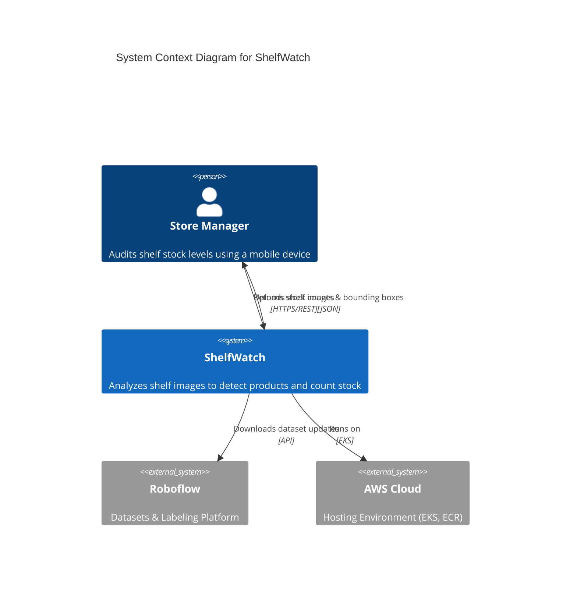
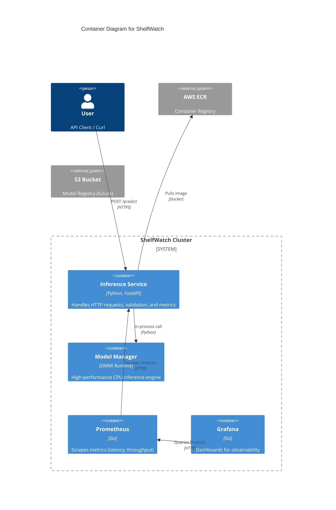
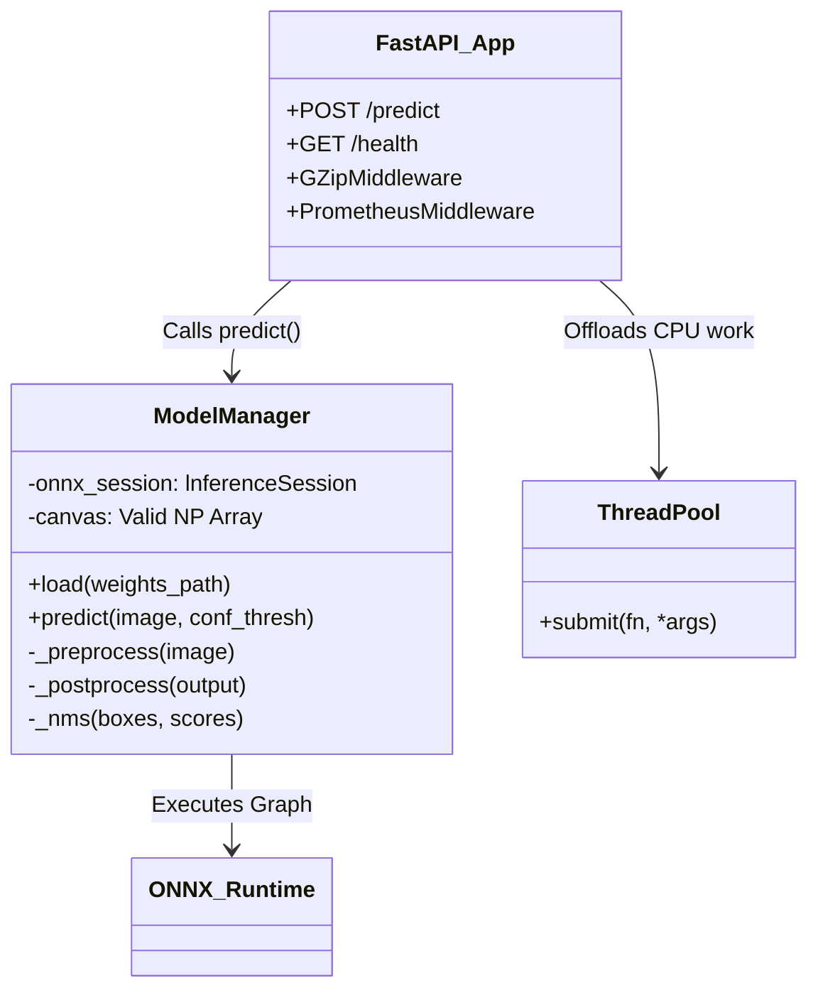
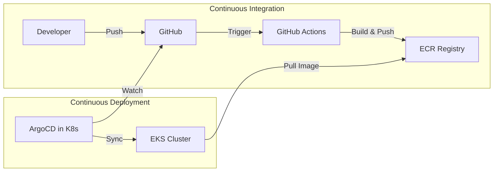

# ShelfWatch — Serverless Shelf Analysis Architecture

## 1. System Design (C4 Model)

### Context View
The high-level interaction between the user (Store Manager) and the ShelfWatch system.

### Container View
The major software containers and their interactions.

### Component View (Inference Service)
Detailed breakdown of the `inference` module.

## 2. Key Design Decisions

### Why ONNX Runtime on CPU?
- **Cost Efficiency**: GPU instances (g4dn.xlarge) cost ~$0.52/hr, while CPU instances (m7i-flex.large) cost ~$0.10/hr.
- **Latency**: For batch=1 inference, the overhead of data transfer to GPU often negates the compute speedup. ONNX Runtime with INT8 quantization achieves <300ms latency on CPU, meeting our SLO.

### Why Baking Weights into Docker Image?
- **Pro**: Simplicity. No need for complex volume mounts (EFS/EBS) or S3 sidecars during startup.
- **Pro**: Versioning. The Docker image tag `v1.0.0` strictly corresponds to model version `v1.0.0`.
- **Con**: Large image size (~150MB extra). Mitigated by layer caching in EKS.

### Observability Strategy
- **Golden Signals**: Latency, Traffic, Errors, Saturation.
- **Implementation**: Prometheus scrapes the `/metrics` endpoint every 15s.
- **Alerting**: Setting alerts on `error_rate > 1%` and `p99_latency > 500ms`.

## 3. Scale Plan
How we would scale from 1 req/s to 1,000 req/s:

1.  **Horizontal Pod Autoscaler (HPA)**: Scale pods based on CPU utilization (target 60%).
2.  **Async Queue**: Move from synchronous HTTP to an async worker pattern (SQS + Celery/k8s-jobs) to buffer bursts.
3.  **CDN / Edge**: Use CloudFront to cache static assets and potentially edge-compute for preprocessing.
4.  **Database**: Introduce DynamoDB to store detection results for historical analysis.

## 4. DevOps & GitOps Architecture

The system uses a **GitOps** approach for continuous delivery, minimizing manual operations and ensuring infrastructure-as-code consistency.

### Components
1.  **Helm Chart**: All K8s resources (Deployment, Service, HPA, ConfigMap) are packaged in `charts/shelfwatch`.
2.  **ArgoCD**: Monitors the `main` branch. When `values.yaml` is updated (e.g., new image tag), ArgoCD automatically synchronizes the cluster.
3.  **Self-Healing**: ArgoCD detects manual changes to the cluster (drifts) and reverts them to match the Git state.
